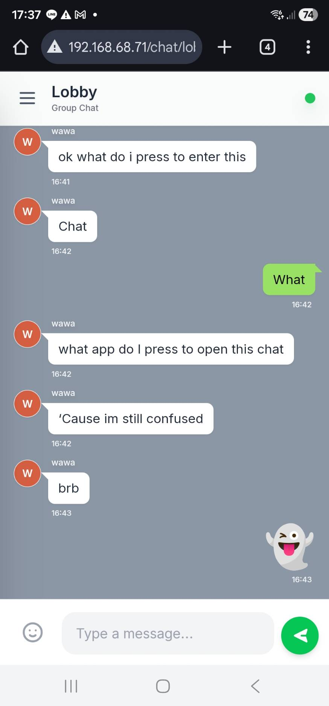
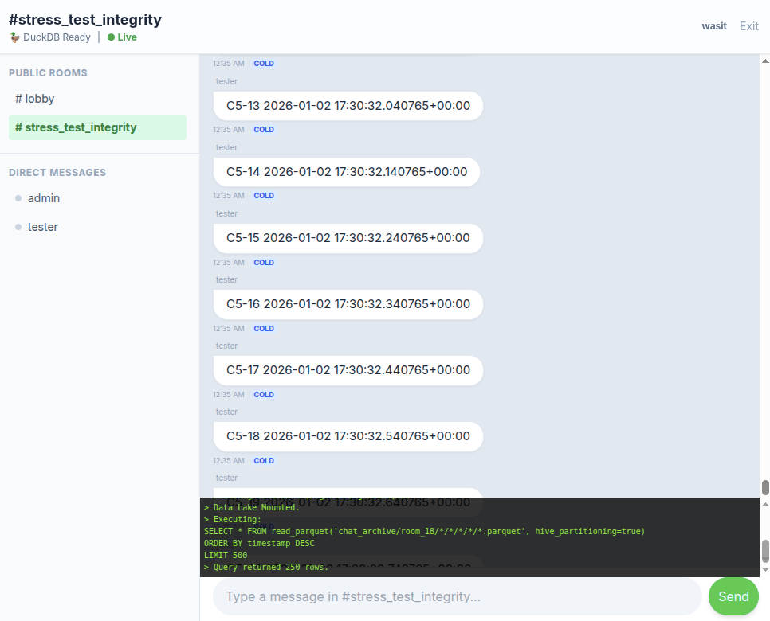

# LINE Clone Architecture Comparison: v3 vs. v4

This document provides a high-level overview and comparison between **Version 3.13 (Scaled Edition)** and **Version 4.30 (Data Lake Edition)** of the LINE Clone project. These two versions represent distinct architectural philosophies for solving the challenges of real-time communication at scale.

## 🚀 Version 3.13: The "Scale-Out" Architecture

**Goal:** Handle high concurrency (1000+ simultaneous users) and minimize message delivery latency.

**Key Philosophy:** "Write-Behind" and Horizontal Scaling. Prioritize getting the message to the recipient *now*, and worry about persisting it to the database *later*.

### Architecture Highlights

* **Write-Behind Pattern:** Messages are broadcast immediately via Redis Pub/Sub for sub-10ms latency. Persistence to PostgreSQL is handled asynchronously by background workers via a Redis queue.
* **Horizontal Scaling:** Designed to run 5+ web replicas behind an Nginx load balancer to handle the "thundering herd" of WebSocket handshakes.
* **Database:** Standard PostgreSQL with increased connection limits (`max_connections=1000`).
* **Features:** WebRTC Video Calling, Mobile-responsive UI, Sticker support.

### Pros & Cons

| Pros | Cons |
| --- | --- |
| ⚡ **Extreme Low Latency:** Users see messages instantly. | ⚠️ **Data Durability Risk:** If Redis crashes before the queue drains, messages are lost. |
| 📈 **High Concurrency:** Handles thousands of active connections easily. | 💾 **Database Bloat:** PostgreSQL stores *everything*, eventually becoming a bottleneck. |
| 🛠️ **Simpler Retrieval:** Standard SQL queries for chat history. |  |

**[View Version 3 Documentation](v3.13/README.md)**

## 🧊 Version 4.30: The "Data Lake" Architecture

**Goal:** Infinite message retention, massive storage scale (1 Million+ messages), and cost efficiency.

**Key Philosophy:** "Zero-DB" and Tiered Storage. The relational database is just a temporary buffer; the true source of truth is an object storage Data Lake.

### Architecture Highlights

* **Tiered Storage:**
* **Hot:** Redis for real-time Pub/Sub.
* **Warm:** PostgreSQL holds only the last ~5 minutes of data.
* **Cold:** MinIO/S3 holds infinite history in **Parquet** format with Hive Partitioning.

* **Smart Client (OLAP):** The browser runs **DuckDB-Wasm** to download Parquet files and execute SQL queries locally. The server does not query the cold history.
* **Secure Proxy:** A Django streaming proxy gates access to the Data Lake, ensuring security without exposing object storage directly.

### Pros & Cons

| Pros | Cons |
| --- | --- |
| ♾️ **Infinite Scalability:** Storage is cheap and effectively limitless (S3/MinIO). | 🐢 **Slower History Load:** Fetching cold history requires downloading files and Wasm compilation. |
| 💰 **Cost Efficient:** Relational DB stays tiny and cheap. | 🧩 **High Complexity:** Requires managing an ETL pipeline, Wasm assets, and file partitions. |
| 🛡️ **Analytics Ready:** Data is already in columnar format for analysis. |  |

**[View Version 4 Documentation](v4.29/README.md)** *(Note: Refer to v4 setup scripts for details)*

## 🏆 Which Version Should You Use?

| Requirement | Recommended Version |
| --- | --- |
| **Real-time Customer Support / Live Event Chat** | **Version 3** (Speed is critical, history is short-lived) |
| **Enterprise Audit Logs / FinTech / Long-term Archival** | **Version 4** (Retention is critical, cost must be low) |
| **Standard Social App Prototype** | **Version 3** (Simpler to deploy and debug) |
| **Big Data Learning / Resume Project** | **Version 4** (Demonstrates advanced Data Engineering concepts) |

## 📂 Quick Links

* **Version 3 Setup:** `bash setup_v3.sh`
* **Version 4 Setup:** `bash setup_v4_29.sh`
* **Version 3 Load Test:** `bash chat_load_test_v3.sh`
* **Version 4 Stress Test:** `bash test_v4_30.sh`