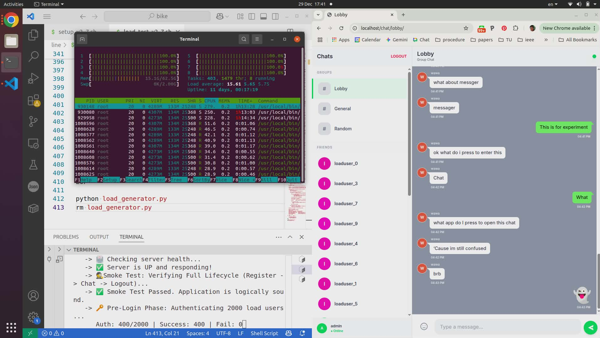

# 🚀 LINE Clone v3.13 - Scaled Performance Edition



**A high-concurrency, real-time chat application engineered to handle "Thundering Herd" scenarios.**

This version introduces a **Write-Behind Architecture**, decoupling real-time messaging from database I/O to support 1000+ concurrent users with sub-millisecond latency. It features a modern Tailwind UI, WebRTC video calling, and a robust Docker-based microservices infrastructure.

---

## ✨ Key Features

### ⚡ Performance & Scalability

* **Write-Behind Pattern:** Chat messages are acknowledged immediately via Redis and persisted to PostgreSQL asynchronously by background workers.
* **Horizontal Scaling:**
* **Web Nodes:** 5x Replicas to handle high-throughput WebSocket handshakes.
* **Workers:** 2x Dedicated workers for processing the DB write queue.


* **Tuned Infrastructure:**
* PostgreSQL configured with `max_connections=1000`.
* Nginx tuned with 24-hour timeouts (`86400s`) to maintain long-lived WebSocket connections.


### 🎥 Real-Time Communication

* **WebRTC Video Calling:** Peer-to-peer video calls with a "Global Notification Banner" that follows users across different rooms.
* **Instant Messaging:** Sub-10ms message delivery using Redis Pub/Sub.
* **Interactive UI:** Tailwind CSS design with sticker support, mobile-responsive sidebar, and "bubble" message styling.

---

## 🏗️ Architecture Overview

The system is composed of four main Docker services:

1. **Nginx (Load Balancer):** Distributes traffic across 5 web replicas using `least_conn` strategy. Handles SSL termination and static files.
2. **Web (Django + Daphne):** Handles WebSocket connections and HTTP requests. Broadcasting is done via Redis Channel Layer.
3. **Worker (Background Consumer):** Runs `run_chat_worker` to drain the Redis queue (`chat_write_queue`) and save messages to the DB.
4. **Data Layer:**
* **Redis (7-alpine):** Message broker and temporary write buffer.
* **PostgreSQL (15-alpine):** Persistent storage for Users, Rooms, and Messages.


---

## 🛠️ Installation & Setup

### Prerequisites

* Docker & Docker Compose
* Python 3 (for load testing scripts)

### Quick Start

1. **Generate the Project Files:**
Run the setup script to create the directory structure and code files.
```bash
bash setup_v3.sh

```


2. **Launch the Stack:**
Build and start the containers.
```bash
cd line_clone_v3_13
docker-compose up -d --scale web=5 --scale worker=2 --build

```


3. **Access the Application:**
* Open `https://localhost` in your browser.
* Accept the self-signed certificate warning (generated during setup).
* **Default Login:** `admin` / `password`


---

## 🧪 Performance Testing

This repository includes two stress test scripts to validate the architecture.

### 1. Chat Write-Behind Latency Test

Measures the **Round Trip Time (RTT)** of messages under load. Because of the Write-Behind pattern, this should remain near-instant even if the DB is busy.

```bash
# Simulates 1000 concurrent users sending messages
bash chat_load_test_v3.sh https://localhost 1000

```

* **Expectation:** `Avg Latency < 100ms` despite high concurrency.

### 2. WebRTC Signaling Stress Test

Tests the Redis Channel Layer's ability to handle large payloads (SDP offers) for video call setup.

```bash
# Simulates 500 concurrent call initiations
bash webrtc_load_test_v3.sh https://localhost 500

```

* **Expectation:** High throughput with minimal packet drops.

---

## 📂 Project Structure

```
line_clone_v3_13/
├── app/
│   ├── chat_app/
│   │   ├── consumers.py       # WebSocket logic (Async)
│   │   ├── management/
│   │   │   └── run_chat_worker.py # Background DB writer
│   │   ├── models.py          # Django ORM models
│   │   └── ...
│   ├── templates/             # HTML Frontend (Tailwind)
│   └── Dockerfile
├── nginx/                     # Load Balancer config
├── docker-compose.yml         # Service orchestration
└── ...

```

---

## ⚠️ Known Trade-offs & Security Notes

* **Data Durability:** Messages are held in Redis before being written to disk. A Redis crash *could* result in minor data loss for the most recent messages (Trade-off for speed).
* **Security:** This version uses `OriginSpoofMiddleware` to bypass standard CSRF/Origin checks for easier local testing. **Do not use this middleware in production.**
* **SSL:** Uses self-signed certificates. For production, replace with Let's Encrypt or valid certs.

---

## 📜 License

Open Source - Educational Purpose Only.